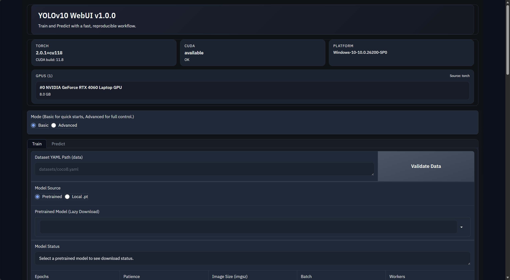
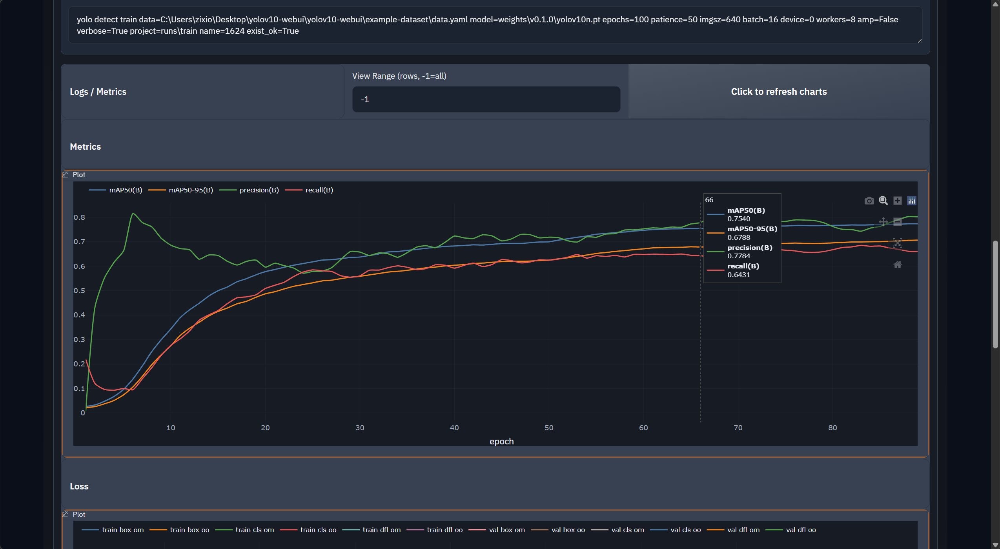
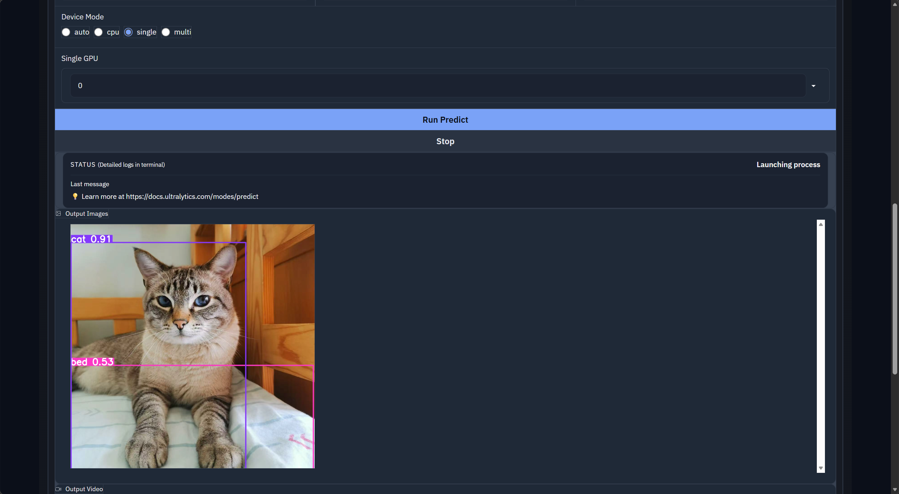

# 🚀 YOLOv10 WebUI

简洁专业的 YOLOv10 可视化训练与推理界面（Gradio）。  
A clean, professional WebUI for YOLOv10 training and inference (Gradio).



---

## 📌 简介 / Overview

本项目基于 YOLOv10，提供可视化训练与推理流程，适合快速实验、演示和模型验证。  
This project builds a visual workflow on top of YOLOv10 for fast experimentation, demos, and validation.

### ✨ 主要特性 / Key Features
- 训练与推理双标签页，流程清晰  
  Train and predict tabs with clear workflow
- 支持本地权重与预训练权重  
  Supports local weights and pretrained weights
- 训练日志、指标图表与数据集检查  
  Logs, charts, and dataset validation
- 简洁美观的深色主题界面  
  Clean, polished dark UI

---

## 🧭 界面展示 / Visuals

训练图表自动生成：  
Auto-generated training charts:
  

---
图形化推理示例：  
GUI inference example:

  


---

## ⚙️ 安装 / Installation

Use the following commands to set the environment.

```bash
conda init
conda create -n webui python=3.9
conda activate webui
pip install -r requirements.txt
pip install -e .
````

---

## 🚀 快速开始 / Quick Start

启动 WebUI：
Launch the WebUI:

```bash
python app.py
```

浏览器访问：
Open in browser:


```
http://127.0.0.1:7860
```

---

## 📘 使用说明 / Usage

### 🏋️ 训练 / Train

1. 选择或输入数据集 YAML 路径（Ultralytics 格式）。
   Set dataset YAML path (Ultralytics format).
2. 选择模型来源（预训练或本地权重）。
   Choose model source (pretrained or local).
3. 设置训练参数（Epochs、Patience、Image Size 等）。
   Configure training params (Epochs, Patience, Image Size, etc.).
4. 点击开始训练并查看日志与指标图表。
   Start training and monitor logs/charts.

### 🔍 推理 / Predict

1. 选择模型权重。
   Select model weights.
2. 上传图片或指定路径进行推理。
   Upload images or set a path for inference.
3. 查看推理结果与可视化输出。
   Review inference results and visual outputs.

---

## 🗂️ 数据集格式 / Dataset Format

支持 Ultralytics 标准 YAML 数据集描述：
Ultralytics-style dataset YAML is supported:

```yaml
path: /path/to/dataset
train: images/train
val: images/val
names:
  0: class0
  1: class1
```

---

## 🙏 致谢 / Acknowledgements

本项目基于 YOLOv10 与 Ultralytics 生态构建。
Built on top of YOLOv10 and the Ultralytics ecosystem.

* YOLOv10: [https://github.com/THU-MIG/yolov10](https://github.com/THU-MIG/yolov10)
* Ultralytics: [https://github.com/ultralytics/ultralytics](https://github.com/ultralytics/ultralytics)
---

## ©️ 版权声明 / License

作者 / Author: **Leo Wang**  
GitHub: https://github.com/LeoWang0814  

项目地址 / Project URL:  
https://github.com/LeoWang0814/yolov10-webui  

本项目遵循 **AGPL-3.0 License**。  
This project is licensed under the **AGPL-3.0 License**.
